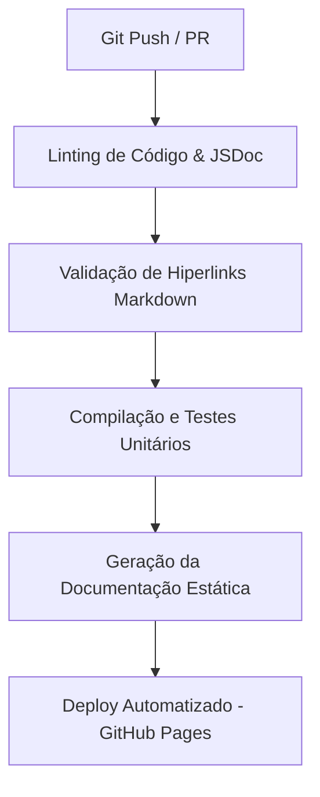

# Proposta de Automação: Pipeline de CI/CD para Documentação Viva

Este documento propõe um fluxo automatizado de integração contínua (CI/CD) usando **GitHub Actions** para validar, compilar e implantar a documentação do **PriceTracker** de forma síncrona com os ajustes de código (Living Documentation).

---

## 1. O Fluxo de Trabalho (Pipeline)

Sempre que um novo código for enviado (*push*) para a branch `main` ou uma solicitação de mesclagem (*pull request*) for aberta, o robô executará as seguintes validações:



---

## 2. Configuração do Workflow (.github/workflows/docs.yml)

Abaixo está a proposta de código em formato YAML para registrar o pipeline de documentação automatizada no GitHub:

```yaml
name: PriceTracker Living Documentation

on:
  push:
    branches: [ main ]
    paths:
      - 'docs/**'
      - 'backend/**'
      - 'frontend/src/**'
  pull_request:
    branches: [ main ]

jobs:
  validate-and-deploy:
    runs-on: ubuntu-latest

    steps:
    # 1. Obter os arquivos do repositório
    - name: Checkout Code
      uses: actions/checkout@v4

    # 2. Configurar o ambiente do Node.js
    - name: Setup Node.js
      uses: actions/setup-node@v4
      with:
        node-size: 20

    # 3. Validar a compilação do front-end React
    - name: Compile and Lint Frontend
      run: |
        cd frontend
        npm install
        npm run build

    # 4. Validar links Markdown nas pastas do Diátaxis
    - name: Validate Markdown Links
      uses: tcort/markdown-link-check@v3.12.0
      with:
        use-quiet-mode: 'yes'
        check-path: 'docs/'

    # 5. Gerar documentação JSDoc automatizada (se aplicável)
    - name: Generate JSDoc Report
      run: |
        cd frontend
        npx jsdoc -c jsdoc.json || true

    # 6. Publicar a documentação no GitHub Pages (apenas se for na branch main)
    - name: Deploy Docs to GitHub Pages
      if: github.ref == 'refs/heads/main'
      uses: peaceiris/actions-gh-pages@v4
      with:
        github_token: ${{ secrets.GITHUB_TOKEN }}
        publish_dir: ./docs
```

---

## 3. Benefícios da Automação de Living Docs

* **Links Sempre Ativos:** O passo `tcort/markdown-link-check` varre todos os 4 quadrantes do Diátaxis. Se um desenvolvedor alterar o nome de um arquivo ou remover uma referência sem ajustar os hiperlinks correspondentes, a build falhará imediatamente, impedindo documentação quebrada na produção.
* **Documentação Viva e Sincronizada:** As anotações JSDoc dos componentes React são compiladas e expostas visualmente, garantindo que o dicionário de classes do front-end nunca fique desatualizado em relação à base real.
