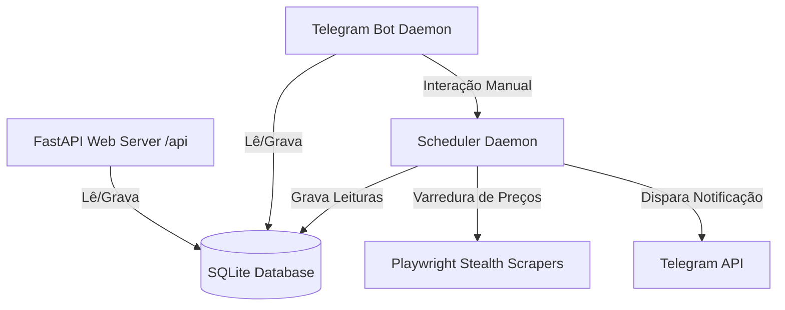

# Explicação Conceitual: Arquitetura, Bypass Stealth e De-duplicação

Este documento descreve os pilares arquiteturais e as decisões de design que tornam o **PriceTracker** uma aplicação robusta, confiável e resiliente, operando de forma autônoma sob restrições severas do mundo real.

---

## 1. Visão Geral da Arquitetura

O PriceTracker foi concebido como um sistema desacoplado composto por três módulos principais que compartilham uma base de dados SQLite comum:



* **Camada de Dados (SQLite):** Atua como o ponto central de verdade. A concorrência é gerenciada nativamente e o formato leve simplifica a implantação local de hardware.
* **Servidor Web (FastAPI + React SPA):** Entrega a experiência de usuário rica em tempo real através de endpoints REST rápidos.
* **Daemons de Background (Bot e Agendador):** Operam de forma independente e assíncrona, garantindo tolerância a falhas e isolamento de processos.

---

## 2. Raspagem Silenciosa (Playwright Evasion & Stealth)

Raspagem de grandes portais de e-commerce (como Amazon e Mercado Livre) sofre bloqueios frequentes caso o navegador emita sinais de automação de teste (ex: `window.navigator.webdriver = true`).

Para contornar este problema, a arquitetura do PriceTracker adota duas táticas cruciais:

1. **Blink Features Control:**
   Ao lançar as instâncias do Chromium no Playwright, injetamos explicitamente o argumento `--disable-blink-features=AutomationControlled`. Isso impede que scripts de validação de terceiros identifiquem a assinatura do webdriver.
2. **Override de Plataforma Linux (Playwright Host Overrides):**
   No Ubuntu 26.04, os navegadores empacotados pelo instalador do Playwright sofrem de incompatibilidades temporárias de dependências da biblioteca gráfica. Para contornar esta restrição técnica sem comprometer a estabilidade do sistema operacional, nossa arquitetura força a variável de ambiente `PLAYWRIGHT_HOST_PLATFORM_OVERRIDE=ubuntu24.04-x64` na instalação. Isso garante drivers compilados robustos e estáveis.

---

## 3. Algoritmo de De-duplicação de Alertas e Spam Prevention

Uma grande falha em sistemas ingênuos de monitoramento é a repetição massiva de notificações idênticas se o preço de um hardware permanecer estável abaixo do preço-alvo ou em estado de promoção prolongada.

Para sanar este débito técnico, criamos um algoritmo de comparação bidirecional antes do disparo de mensagens:

```python
# Algoritmo contido no loop principal de main.py
current_price = res["price"]
history = get_price_history(prod_id, limit=1)
prior_price = history[0]["price"] if history else None

if is_promo:
    if prior_price is not None and current_price == prior_price:
        # Preço promocional estável. Ignora para evitar spam.
        log("Promoção ativa estável. Notificação ignorada.")
    else:
        # Dispara o alerta do Telegram
        send_telegram_alert(..., is_promo=True)
```

### Por que isso é importante?
Se o agendamento de verificação for reduzido para 1 em 1 hora, e uma placa de vídeo de R$ 3.000,00 sofrer um desconto de 15% (caindo para R$ 2.550,00), o sistema notificará você na primeira hora. Nas horas subsequentes, enquanto a placa continuar custando exatamente R$ 2.550,00, a notificação será silenciada, poupando a sua atenção e evitando spam no Telegram.
